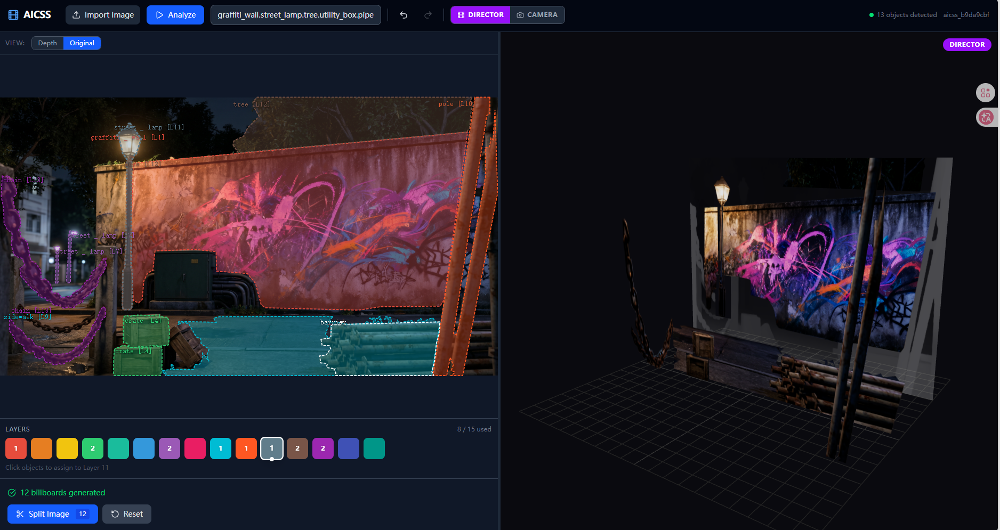

# AI Cinematic Spatial System (AICSS)

> 将一张 2D 电影图像转换为具有深度层次感的伪 3D 空间场景 — 通过边缘感知掩码分割物体，按 Z 轴深度分层排列，在 Three.js 视口中渲染为可交互的 Billboard 贴图。

**[English Version](./README.md)**

---

## 系统架构

```
用户上传图像
        │
        ▼
┌──────────────────────────────────────────────────────────────┐
│  前端  (React + Vite + Tailwind)                            │
│                                                              │
│  Toolbar  →  ImageCanvas  →  LayerSelector  →  SplitControls│
│                          (2D SVG)         (调色板)           │
│                                                              │
│  Viewer3D (Three.js)  ←  billboard RGBA 纹理                 │
└──────────────────────────────────────────────────────────────┘
        │  POST /api/aicss/analyze
        ▼
┌──────────────────────────────────────────────────────────────┐
│  后端  (FastAPI + Uvicorn)                                   │
│                                                              │
│  /analyze          — 完整管线                                │
│  /billboard        — 多边形裁剪 RGBA 切图                    │
│  /multiface        — 6 面伪 3D 纹理                         │
└──────────────────────────────────────────────────────────────┘
        │
        ▼
┌──────────────────────────────────────────────────────────────┐
│  ML 模型 (PyTorch，启动时一次性加载)                          │
│                                                              │
│  DepthAnything V2-Large    ← 深度图                         │
│  Grounding DINO Base       ← 检测框 + 置信度                  │
│  SAM2.1 ViT-L              ← 实例掩码                       │
│                                                              │
│  后处理：Canny 边缘修正 → polygon 轮廓点                      │
└──────────────────────────────────────────────────────────────┘
```

## 界面预览



## 目录结构

```
.
├── frontend/                    # React 19 + TypeScript + Vite + Tailwind
│   ├── src/
│   │   ├── App.tsx              # 根布局：工具栏 + 2D/3D 分屏
│   │   ├── main.tsx             # React 挂载入口
│   │   ├── index.css            # 全局样式（Tailwind base）
│   │   ├── components/
│   │   │   ├── ImageCanvas.tsx  # 2D SVG 画布 — 多边形/矩形掩码、图层着色
│   │   │   ├── LayerSelector.tsx# 15 色调色板，用于深度分层
│   │   │   ├── SplitControls.tsx# "Split Image" → 生成 billboard RGBA 纹理
│   │   │   └── Viewer3D.tsx     # Three.js 画布 — Billboard 在 Z 深度 3D 空间
│   │   ├── services/
│   │   │   └── aicssService.ts  # Axios 客户端，调用后端所有接口
│   │   ├── store/
│   │   │   └── useAppStore.ts   # Zustand 全局状态管理
│   │   └── types/
│   │       └── index.ts         # TypeScript 接口定义
│   ├── dist/                    # 生产构建（gitignored）
│   ├── node_modules/            # （gitignored）
│   ├── package.json
│   ├── vite.config.ts
│   └── README.md
│
├── backend/                     # Python 3.10+ · FastAPI · PyTorch
│   ├── app/
│   │   ├── main.py              # FastAPI 应用、CORS、生命周期（模型加载）
│   │   ├── config.py            # 所有配置项通过 AICSS_* 环境变量读取
│   │   ├── endpoints.py         # 所有 REST 端点（analyze、billboard 等）
│   │   ├── models/
│   │   │   ├── model_manager.py # 单例：启动时加载全部 3 个 ML 模型
│   │   │   ├── depth_loader.py  # DepthAnything V2 封装
│   │   │   ├── grounding_dino_loader.py  # Grounding DINO 封装
│   │   │   └── sam2_loader.py   # SAM2 + refine_mask_edges + extract_polygon_from_mask
│   │   └── utils/
│   │       ├── image_utils.py   # base64/PIL 工具、深度缩放、RGBA 生成器
│   │       └── spatial_utils.py # 深度分层、场景图构建
│   ├── thirdparty/              # 本地 SAM2 构建（gitignored）
│   ├── sam2.1_l.pt             # SAM2.1 ViT-L 权重文件（gitignored，约 449 MB）
│   ├── requirements.txt
│   ├── run.py                   # `python run.py` 启动脚本
│   ├── README.md
│   └── SPEC.md
│
├── .gitignore                   # 忽略 frontend dist/node_modules、backend .venv/sam2.1_*.pt
└── README.md                    # （英文版）
```

---

## 管线：从图像到 3D 场景

### Step 1 — 深度估计
`DepthAnything V2 Large` 接收整张图像，输出**深度图**（H×W，归一化 0–1），按默认系数 50 缩放为近似米制深度。

### Step 2 — 目标检测
`Grounding DINO Base` 接收用户输入的分隔提示词（如 `"person,car,building,tree"`），返回每个检测类别的**检测框 + 置信度分数**。

### Step 3 — 实例分割
`SAM2.1 ViT-L` 以每个检测框为提示，生成每个物体的**像素级二值掩码**。

### Step 4 — 边缘修正（后处理）
提取 SAM2 掩码轮廓，**吸附到附近的 Canny 边缘**（最大吸附距离 8 px），使多边形边界贴合物体真实轮廓。经 Douglas-Peucker 简化（弧长 × 0.002 阈值）后，以 `[[x_norm, y_norm], ...]` 格式返回。

### Step 5 — 空间分层
在掩码区域内计算深度图的中位数深度，将物体分配到对应层次：

| 层次        | Z 轴范围   |
|-------------|-----------|
| foreground  | 0 – 5 m   |
| midground   | 5 – 15 m  |
| background  | 15 – 50 m |
| sky         | 50 m 以上  |

### Step 6 — 场景图
通过检测框质心偏移量和物体间的深度差，推导空间关系（`leftOf`、`rightOf`、`inFrontOf`、`behind`、`above`、`below`）。

### Step 7 — Billboard 生成
用户点击 **Split Image** 后，每个已分配的物体发送到 `/api/aicss/billboard`。后端按多边形紧致包围盒裁剪图像，用多边形掩码生成**透明 RGBA PNG**（掩码外区域 alpha = 0）。

### Step 8 — 3D 渲染
Three.js `Viewer3D` 将每个物体的 Billboard 作为平面放入世界空间：
- **X**：由检测框中心计算
- **Y**：由检测框中心计算（3D Y 轴翻转）
- **Z**：由中位数深度映射，范围 –5（近）… +5（远）

---

## API 参考

基础 URL：`http://localhost:8000`（可通过 `VITE_AICSS_BACKEND` 修改）

### 完整管线
```
POST /api/aicss/analyze
请求体: { "imageUrl": "data:image/...", "segmentationPrompt": "person,car,tree", "shotId": "shot_001" }
响应:   { analysisId, depthMapUrl, objects[], layers[], sceneGraph }
```

### Billboard（RGBA 切图）
```
POST /api/aicss/billboard
请求体: { "imageUrl": "...", "objectId": "...", "boundingBox": {x,y,w,h}, "polygon": [[x,y],...] }
响应:   { "billboardUrl": "data:image/png;base64,..." }
```
提供 `polygon`（3 个及以上点）时优先使用多边形裁剪，空值或点数不足时回退为矩形包围盒。

### 6 面伪 3D
```
POST /api/aicss/multiface
请求体: { "imageUrl": "...", "objectId": "...", "boundingBox": {...}, "polygon": [...] }
响应:   { "faces": { front, back, left, right, top, bottom } }
```

### 单独调用
```
POST /api/aicss/depth        → { depthMapUrl }
POST /api/aicss/segment      → { objects[] }
POST /api/aicss/layers       → { layers[] }
POST /api/aicss/scene-graph  → { sceneGraph }
GET  /health                 → { status, device, models_loaded }
```

交互式文档：`http://localhost:8000/docs`（Swagger）或 `http://localhost:8000/redoc`（ReDoc）。

---

## 配置说明

### 前端

| 文件 | 变量 | 默认值 | 说明 |
|---|---|---|---|
| `frontend/.env` | `VITE_AICSS_BACKEND` | `http://localhost:8000` | 后端基础地址 |

### 后端

| 环境变量 | 默认值 | 说明 |
|---|---|---|
| `AICSS_HOST` | `0.0.0.0` | 服务监听地址 |
| `AICSS_PORT` | `8000` | 服务端口 |
| `AICSS_DEVICE` | `cuda` | `cuda` 或 `cpu` |
| `AICSS_DEPTH_MODEL` | `depth-anything/Depth-Anything-V2-Large-hf` | HuggingFace 深度模型 ID |
| `AICSS_GROUNDING_DINO_MODEL` | `IDEA-Research/grounding-dino-base` | HuggingFace 检测模型 ID |
| `AICSS_SAM2_MODEL_SIZE` | `vit_l` | SAM2 规模：`vit_l`、`vit_b`、`vit_s`、`vit_t` |
| `AICSS_SEGMENTATION_PROMPT` | `person,car,building,tree,...` | 逗号分隔的检测类别列表 |
| `AICSS_HF_TOKEN` | _(空)_ | HuggingFace 令牌（访问私有模型需填写） |

---

## 快速开始

### 环境要求
- Python 3.10+
- Node.js 18+
- CUDA 12.x（GPU 加速，推荐）

### 1 — 后端

```bash
cd backend

# 创建虚拟环境
python -m venv .venv

# 激活（PowerShell）
.\.venv\Scripts\Activate.ps1

# 安装 PyTorch（CUDA 12.1）+ 依赖
pip install torch torchvision --index-url https://download.pytorch.org/whl/cu121
pip install -r requirements.txt

# 下载 SAM2 权重文件，放入 backend/ 目录，文件名为 sam2.1_l.pt
# 下载地址：https://github.com/facebookresearch/segment-anything-2/releases

# 启动服务（模型在启动时加载）
python run.py
# 或：.venv\Scripts\python run.py
```

### 2 — 前端

```bash
cd frontend

npm install
npm run dev      # http://localhost:5173
```

### 3 — 使用流程

1. 打开 `http://localhost:5173`
2. 点击 **Import Image** 选择一张照片
3. 可选：修改分隔提示词（如 `"person,tree,building"`）
4. 点击 **Analyze** — 等待深度图 + 掩码 + 分层生成完成
5. 点击物体 + 颜色色块，为物体分配深度层次
6. 点击 **Split Image** — 生成 Billboard 贴图
7. 切换到 **Camera** 模式，旋转查看 3D 场景

---

## 模型磁盘占用

| 模型 | 约占用空间 |
|---|---|
| DepthAnything V2 Large | ~600 MB |
| Grounding DINO Base | ~400 MB |
| SAM2.1 ViT-L | ~449 MB |
| **总计（不含缓存）** | **约 1.4 GB** |

HuggingFace 下载缓存（`~/.cache/huggingface/`）和 thirdparty SAM2 构建目录已加入 .gitignore。

---

## 核心数据结构

```typescript
// 多边形轮廓点 — 边缘修正后，归一化 0-1
type PolygonPoint = [number, number];

// 单个检测到的物体
interface DetectedObject {
  id: string;
  classLabel: string;
  depth: number;                // 中位数深度，单位米
  boundingBox: BoundingBox;    // {x, y, w, h} 归一化 0-1
  maskDataUrl: string;        // base64 PNG 掩码图像
  polygon: PolygonPoint[];     // 边缘修正后的轮廓点（Douglas-Peucker 简化）
  layer: string;              // "foreground" | "midground" | "background" | "sky"
}

// 完整分析响应
interface AicssResult {
  analysisId: string;
  depthMapUrl: string;
  objects: DetectedObject[];
  layers: SpatialLayer[];
  sceneGraph: SceneGraph;
}
```

---

## 前端状态管理（Zustand）

`useAppStore` 是全局唯一数据源：

| 状态键 | 类型 | 用途 |
|---|---|---|
| `originalImageUrl` | `string` | 导入图像的完整 data URL |
| `imageWidth / imageHeight` | `number` | 原始像素尺寸 |
| `analysisResult` | `AicssResult \| null` | 完整管线返回结果 |
| `imageMode` | `'depth' \| 'original'` | 2D 面板背景：深度图或原图 |
| `assignments` | `Record<objectId, colorIndex>` | 物体 → 图层颜色映射 |
| `selectedLayerIndex` | `number \| null` | 当前激活的色块索引 |
| `billboardAssets` | `Record<objectId, BillboardAsset>` | 后端返回的 RGBA 纹理 |
| `editMode` | `'director' \| 'camera'` | 导演模式 = 分配图层；相机模式 = 调整 Billboard 位置 |
| `past / future` | `HistoryEntry[]` | 图层分配的历史记录（撤销/重做） |
