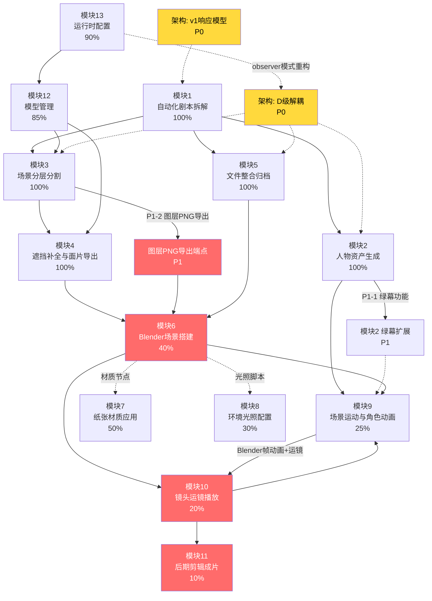

# AICinematicSpatialSystem 实施计划

> **文档版本**：v1.1
> **制定日期**：2026-08-10；**对照修订**：2026-09-26
> **依据**：`PROJECT_STATUS.md`（基准，本文不修改该文件）
> **目标**：约 6-8 周完成可演示的端到端纸雕风格动画短片生产流程
>
> **落地状态（2026-09-26，以基准第五节及当前代码为准）**
>
> 阶段一及 1.5 闭环已交付：图层 PNG 导出（现为 5 层，含 ground）、`backend/blender/addons/aicss_scene_builder/`、Three.js 运镜播放、`settings_observer` / `LLMMode` / `ImageGeneratorInterface`、v1 Pydantic 响应模型、下载进度与断点续传、`~/.aicss/settings.json`、Provider 注册表。
>
> 基准第三节里仍未划掉、代码也未完成的项，继续作为本文剩余工作：模块 11 后期剪辑、模块 10 的 Blender 摄影机与渲染队列、模块 9 的 Blender 帧动画、模块 8 光照面板、模块 7 的 SSS/纤维（插件里 Subsurface 默认仍为 0）、模块 6 的角色落位与层次搭建。
>
> 下文任务正文保留原始拆解，避免改写已执行过的步骤；退出标准复选框已按上述状态勾选。阶段二里「设置持久化 / 抠像羽化 / 精细 Z」和阶段四里「绿幕 / 首尾帧」在基准中已标完成，不要再当未开工项排期。

---

## 一、模块依赖关系与依赖链可视化



**关键路径（最长链，决定总工期）**：

```
剧本解析 → 场景分层 → 图层PNG导出 → Blender插件 → 运镜播放 → Blender运镜渲染 → 后期剪辑
```

---

## 二、架构与技术债修复计划（贯穿全程）

在功能开发的同时，必须并行处理以下架构问题，否则后期维护成本随功能增加而急剧上升。

### A. 架构缺陷（必须修复，否则阻塞系统稳定性）

| 编号 | 问题 | 级别 | 修复方案 | 影响范围 |
|:----:|------|:----:|----------|----------|
| A-1 | `settings_manager` 直接 `setattr(settings, ...)` 修改全局单例，内容耦合 D 级 | P0 | 引入 **observer 模式**：`SettingsManager` 维护内部状态，变更时通过事件总线通知各消费者 | 所有 service |
| A-2 | `local_llm` 模块级 `_use_cloud` 全局变量，控制耦合 C 级 | P0 | 改为 `LLMMode` 上下文变量或注入到各 consumer 的 `__init__` | script_parser, character_generator, scene_generator, shot_generator |
| A-3 | `image_generator` 模块级单例 `_img_gen`，无锁保护生成中卸载 | P0 | 引入 `ImageGeneratorInterface` 抽象 + `threading.RLock`，生成期间禁止 reconfigure | image_generator, character_generator, scene_generator |
| A-4 | v1 端点（`endpoints.py` ~850行）返回 `-> dict` 而非 Pydantic 模型 | P0 | 为 `POST /analyze`, `/inpaint`, `/paper-diorama`, `/depth`, `/segment`, `/layers` 补充响应模型 | `endpoints.py` 第 230-1080 行 |

### B. 便利性改进（降低用户体验摩擦）

| 编号 | 问题 | 级别 | 修复方案 | 影响范围 |
|:----:|------|:----:|----------|----------|
| B-1 | 运行时设置不持久化，重启丢失 | P1 | 持久化到 `~/.aicss/settings.json`，启动时加载 | settings_manager, config |
| B-2 | 模型下载无进度条（仅 spinner） | P2 | loader 透传 `tqdm` 进度到 `download_jobs` 注册表 | model_manager, 各 *_loader |
| B-3 | 模型下载无断点续传，大模型易失败 | P2 | 集成 `huggingface_hub` 的 `resume_download=True` | download_jobs |
| B-4 | 前端无类型安全 API 客户端，字段映射隐式依赖 snake_case | P1 | 集成 `openapi-typescript-codegen`，自动生成类型安全客户端 | frontend services/ |

---

## 三、阶段计划详解

---

### 阶段一：核心贯通（第 1-2 周）

**目标**：打通 2D → 3D 管线，建立 Blender 可用插件，实现镜头运镜 Three.js 播放，修复核心架构耦合。

#### 目标与交付物

1. **图层 PNG 导出端点**上线（`POST /api/aicss/layers/export`）
2. **Blender 独立插件** `.py` 文件可用，可导入 Blender 并自动搭建纸雕场景
3. **运镜数据 → Three.js 相机路径动画**可预览播放
4. **架构 A-1、A-2、A-3** 修复（settings_manager observer、LLMMode 上下文、图像生成器接口）
5. **架构 A-4** 部分完成（v1 端点响应模型）

#### 具体任务

##### 1.1 图层 PNG 导出端点（模块3 → 模块6，阻塞 Blender）

**任务 1.1.1**：`backend/app/services/layer_exporter.py`（新建）

- 接收参数：`imageUrl`（原始图）、`layerAssignments`（来自 `spatial_utils.assign_to_depth_layer` 的前景/中景/背景/天空分组）
- 对每个图层生成 **RGBA PNG**：可见区域保留原像素，其余填透明
- 输出：`{ foreground: "data URI PNG", midground: "...", background: "...", sky: "..." }`
- 深度值排序（Z 轴顺序标注在 manifest 中，供 Blender 使用）

**任务 1.1.2**：`backend/app/endpoints_layers.py`（新建）

- 路由：`POST /api/aicss/layers/export`
- 请求体：`LayerExportRequest(imageUrl: str, layerAssignments: list[DepthLayerObject])`
- 响应体：`LayerExportResponse`（Pydantic model，包含 4 个 data URI + Z 轴偏移表）

**任务 1.1.3**：集成到 `auto_three_view.py` 流程末尾

- 在场景三关键帧生成完成后，自动调用图层导出
- manifest 中记录 `layeredImages` 路径

**Exit Criteria**：调用 `/api/aicss/layers/export` 返回 4 层 PNG，前景层无中景/背景内容，中景层无前景内容。

---

##### 1.2 Blender 独立插件（模块6，P0）

**任务 1.2.1**：`backend/blender/addons/aicss_scene_builder/` 目录结构

```
aicss_scene_builder/
    __init__.py          # Blender 插件注册 (bl_info)
    operators/
        __init__.py
        import_layers.py   # 导入图层 PNG 并按 Z 轴放置
        setup_camera.py    # 摄影机初始位置设置
        add_lighting.py    # 三点光照设置
    materials/
        __init__.py
        paper_material.py  # 纸张材质节点组（Principled BSDF + Normal Map + SSS）
    ui/
        __init__.py
        aicss_panel.py     # 侧栏面板：导入场景 / 预览运镜 / 导出渲染
    utils/
        __init__.py
        scene_utils.py     # Z 轴偏移常量（前景=-2, 中景=-6, 背景=-12, 天空=-20）
        paper_nodes.py      # 纸张材质节点组复用函数
    presets/
        lighting/          # 预置光照方案 JSON
            warm_interior.json
            cool_exterior.json
            dramatic.json
```

**任务 1.2.2**：`__init__.py` — Blender 插件注册

```python
# 核心：注册纸雕场景构建器插件
bl_info = {
    "name": "AICinematicSpatialSystem Scene Builder",
    "author": "AICSS Team",
    "version": (1, 0, 0),
    "blender": (4, 0, 0),
    "location": "View3D > Sidebar > AICSS",
    "category": "Import-Export",
}
```

**任务 1.2.3**：`operators/import_layers.py` — 核心导入操作符

- `IMPORT_OT_aicss_layers`：从 manifest JSON 读取图层 PNG，按 Z 轴偏移放置为平面网格
- 支持 4 层（前景/中景/背景/天空），每层可独立隐藏/显示
- 支持单层细分（subdivide）为 3D 场景

**任务 1.2.4**：`operators/setup_camera.py` — 摄影机初始化

- 根据景别枚举（wide/medium/closeup）设置初始 FOV 和距离
- 创建摄影机目标空物体（Empty）用于轨道控制

**任务 1.2.5**：`materials/paper_material.py` — 纸张材质节点

```python
# 纸张材质节点组（v1）：
# ImageTexture → ColorRamp(卡通化) → Principled BSDF (Base Color)
# ImageTexture → Normal Map → Principled BSDF (Normal)
# Principled BSDF: Roughness=0.9, Specular=0.0, Subsurface=0.1
```

**任务 1.2.6**：`ui/aicss_panel.py` — Blender UI 侧栏面板

- "导入场景"按钮：调用 `IMPORT_OT_aicss_layers`
- "应用纸张材质"按钮：遍历选中物体应用 paper_material
- "设置运镜"下拉菜单：wide / medium / closeup
- "导出 FBX/GLB"按钮：调用 Blender 内置导出操作符

**Exit Criteria**：
- 在 Blender 4.2 中安装插件并激活，无报错
- 点击"导入场景"可加载 4 层 PNG 并按 Z 轴排列
- 材质面板可调整 Roughness（0.5-1.0）和 SSS（0.0-0.3）参数

---

##### 1.3 运镜自动播放（模块10，Three.js）

**任务 1.3.1**：`frontend/src/utils/cameraAnimation.ts`（新建）

- 将 13 种 `CameraMovement` 枚举映射为 Three.js `CameraKeyframe` 数组
- 关键帧结构：`{ time: number, position: Vector3, target: Vector3, fov: number }`
- 运镜类型映射：

| CameraMovement | 运动描述 | 实现方式 |
|----------------|----------|----------|
| STATIC | 固定镜头 | 单关键帧 |
| PAN_LEFT/RIGHT | 水平平移 | 线性插值 position.x |
| TILT_UP/DOWN | 垂直摇镜 | 线性插值 position.y |
| DOLLY_IN/OUT | 推进/拉远 | 线性插值 position.z + FOV |
| TRACK_LEFT/RIGHT | 跟随侧移 | 线性插值 position.x + z |
| CRANE_UP/DOWN | 升降 | 弧形路径插值 |
| ZOOM_IN/OUT | 焦距变化 | 线性插值 FOV |
| ARC | 弧形环绕 | 贝塞尔曲线插值 |

**任务 1.3.2**：`frontend/src/components/ShotPlaybackControls.tsx`（新建）

- 播放/暂停/停止按钮
- 速度控制：0.5x / 1x / 2x
- 进度条（基于 shot 的 duration）
- 当前运镜类型标签

**任务 1.3.3**：集成到 `frontend/src/components/Viewer3D.tsx`

- 接收 `currentShot: Shot` prop，自动启动相机路径动画
- 镜头切换时平滑过渡（GSAP 或手写 lerp）
- 移除现有的硬编码 OrbitControls 自动模式

**任务 1.3.4**：`backend/app/services/shot_playback_generator.py`（新建）

- 后端辅助端点 `GET /api/aicss/v2/shots/{shotId}/camera-path`
- 返回 Three.js 可直接消费的 camera keyframes JSON
- 从 shot 的 `camera_movement` + `duration` + `shot_type` 推算关键帧

**Exit Criteria**：在 StoryboardTab 中点击任意 shot，自动播放对应运镜动画（不依赖手动拖拽）。

---

##### 1.4 架构修复 P0（settings_manager / local_llm / image_generator）

**任务 1.4.1**：`services/settings_manager.py` 重构 — observer 模式

```
变更前：D级耦合，直接 setattr(settings, key, value)
变更后：
  class SettingsManager:
      _state: dict  # 内部状态，不直接修改 config.settings
      _observers: list[SettingsObserver]
      
      def update(updates):
          for k, v in updates.items():
              self._state[k] = v
              self._notify(k, v)  # 通知各 observer
      
  # Observer 示例：
  class ImageGeneratorObserver(SettingsObserver):
      def on_setting_changed(self, key, value):
          if key in ['image_model', 'image_dtype']:
              configure_image_generator(value)
```

**任务 1.4.2**：`services/local_llm.py` 重构 — LLMMode 上下文

```
变更前：C级耦合，模块级 _use_cloud = False
变更后：
  from contextvars import ContextVar
  _llm_mode: ContextVar[LLMMode] = ContextVar('llm_mode', default=LLMMode.CLOUD)
  
  def get_llm_client() -> LLMClient:
      mode = _llm_mode.get()
      if mode == LLMMode.CLOUD:
          return CloudRouterProxy()
      return LocalLLMClient()
  
  # settings_manager 调用时设置上下文：
  def set_llm_mode(mode: LLMMode):
      _llm_mode.set(mode)
```

**任务 1.4.3**：`services/image_generator.py` 重构 — 接口抽象

```python
class ImageGeneratorInterface(Protocol):
    def generate(self, prompt: str, **kwargs) -> GeneratedImage: ...
    def configure(self, model_id: str, dtype: str) -> None: ...

class LocalImageGenerator(ImageGeneratorInterface):
    _lock: threading.RLock  # 生成期间禁止 reconfigure
    
    def generate(self, prompt: str, **kwargs):
        with self._lock:
            # ... 执行生成 ...
    
    def configure(self, model_id: str, dtype: str) -> None:
        # reconfigure 只能在无生成进行时调用
        with self._lock:
            self._model_id = model_id
            self._dtype = dtype
```

**任务 1.4.4**：v1 端点响应模型（`endpoints.py`）

为以下端点补充 Pydantic 响应模型：

- `POST /api/aicss/analyze` → `AnalyzeResponse`
- `POST /api/aicss/inpaint` → `InpaintResponse`
- `POST /api/aicss/paper-diorama` → `PaperDioramaResponse`
- `POST /api/aicss/depth` → `DepthResponse`
- `POST /api/aicss/segment` → `SegmentResponse`
- `POST /api/aicss/layers` → `LayersResponse`

**Exit Criteria**：
- `settings_manager.update_settings()` 不再直接修改 `config.settings` 对象
- `get_llm_client()` 的行为由调用方的上下文决定，而非模块级全局变量
- `image_generator.generate()` 和 `configure()` 有 `RLock` 保护
- OpenAPI 文档可显示 v1 端点的完整响应 schema

---

#### 阶段一风险评估

| 风险 | 可能性 | 影响 | 缓解措施 |
|------|:------:|:----:|----------|
| Blender 插件 API 变更（Blender 4.3 即将发布） | 中 | 高 | 固定测试 Blender 4.2，记录不兼容 API |
| Three.js 相机动画与现有 Viewer3D 冲突 | 中 | 中 | 用 feature flag 控制，优先修改 Viewer3D 集成 |
| observer 模式重构导致现有端点行为变化 | 中 | 高 | 全量回归测试（至少 3 个端点流程） |
| 图层 PNG 内存占用过高（4K 图像 × 4 层） | 低 | 中 | 64-bit 处理，按需加载，避免全量 decode |

#### 阶段一时间估算

| 任务 | 复杂度 | 估算时间 | 并行可行性 |
|------|:------:|:--------:|:----------:|
| 图层 PNG 导出端点 | 中 | 2 人天 | 可并行 |
| Blender 插件开发 | 高 | 4-5 人天 | 独立 |
| 运镜 Three.js 播放 | 中 | 2-3 人天 | 可并行 |
| 架构修复（A-1~A-3） | 中 | 2-3 人天 | 可并行（不同人负责不同模块） |
| v1 响应模型（A-4） | 低 | 1 人天 | 可并行 |
| **合计** | — | **11-14 人天 ≈ 2 周** | — |

---

### 阶段二：质量提升（第 3-4 周）

**目标**：完善 Blender 材质节点和光照系统，实现精细 Z 轴偏移，启用抠像羽化，修复模块间耦合。

#### 目标与交付物

1. **Blender 材质节点**完整（Normal Map + SSS + 纸张纤维）
2. **光照配置系统**可用（动态 Blender 光照脚本 + 前端面板）
3. **精细 Z 轴偏移**在后端实现（非 bucket 级别）
4. **厚度纹理**驱动实际几何厚度
5. **抠像边缘羽化**启用（调用 SAM2 的 `refine_mask_edges`）
6. **settings 持久化**完成（B-1）

#### 具体任务

##### 2.1 Blender 材质节点完善（模块7）

**任务 2.1.1**：`backend/blender/addons/aicss_scene_builder/materials/paper_material.py` 升级

```python
# v2 材质节点组：
# 基础色流程：
#   ImageTexture → ColorRamp(卡通化) → Principled BSDF (Base Color)
#
# 法线贴图流程：
#   ImageTexture → Normal Map → Principled BSDF (Normal)
#   (Normal Map strength = 0.8, 可调)
#
# SSS 流程（v1 未实现）：
#   Principled BSDF → Subsurface: 0.15, Subsurface Color: #FFF5E6
#   Subsurface IOR: 1.4, Subsurface Radius: (0.1, 0.05, 0.02)
#
# 纸张纤维（v1 未实现）：
#   Procedural Noise Texture → ColorRamp → Principled BSDF (Normal)
#   Scale=50, Detail=8, Distortion=0.3
```

**任务 2.1.2**：`frontend/src/components/MaterialPanel.tsx`（新建）

- Roughness 滑块（0.5-1.0）
- SSS Intensity 滑块（0.0-0.3）
- Normal Map Strength 滑块（0.0-1.0）
- 纸张纤维开关 + Scale 滑块
- 预设：宣纸 / 牛皮纸 / 特种纸

**任务 2.1.3**：`backend/blender/addons/aicss_scene_builder/operators/material_ops.py`（新建）

- `APPLY_OT_paper_material`：选中的 mesh 应用纸张材质
- 读取前端面板参数，生成 Blender Python 脚本执行

---

##### 2.2 光照配置系统（模块8）

**任务 2.2.1**：`backend/app/services/lighting_generator.py`（新建）

- 输入：`SceneType`（forest/campus/interior/outdoor）+ `MoodTag`（warm/dramatic/mysterious）
- 输出：Blender 三点光照 JSON 配置

```python
# 光照方案生成
lighting_presets = {
    ("campus", "warm"): {
        "key": {"type": "SUN", "energy": 3.0, "color": "#FFF5E0", "angle": 45},
        "fill": {"type": "AREA", "energy": 1.5, "color": "#CCE5FF", "size": 5.0},
        "rim": {"type": "SPOT", "energy": 2.0, "color": "#FFEECC", "angle": 60},
    },
    # ... 其他组合
}
```

**任务 2.2.2**：`backend/blender/addons/aicss_scene_builder/operators/add_lighting.py`

- `ADD_OT_aicss_lighting`：从 JSON 配置创建 Blender 光照对象
- 支持 Key Light（主光）、Fill Light（补光）、Rim Light（轮廓光）
- 支持 HDRI 环境光照（可选）

**任务 2.2.3**：`frontend/src/components/LightingPanel.tsx`（新建）

- 场景类型选择 + 情绪标签选择
- 预览光照方案（Three.js 实时预览）
- 导出 Blender 光照脚本按钮

---

##### 2.3 精细 Z 轴偏移与厚度纹理（模块4）✅ 已完成

> **状态（2026-08-22）**：已在 `mesh_exporter._compute_fine_z_offset()` + `make_displaced_plane()` 落地；厚度纹理由 `paper_diorama` 生成。以下任务描述保留作历史参考。

**任务 2.3.1**：`services/mesh_exporter.py` 改造 ✅

- **精细 Z 轴**：读取 `depth_loader` 的 `depth_values`（每个像素的 0-1 深度值），映射到 Z 轴偏移
- 公式：`z_offset = depth_value * layer_depth_range + layer_base_z`
  - 前景层 range=2.0, base=-2
  - 中景层 range=6.0, base=-6
  - 背景层 range=6.0, base=-12
  - 天空层 range=8.0, base=-20
- **厚度纹理**：读取 `thicknessGrayUrl`（距离变换灰度图），控制每个三角面的 extrude 厚度
  - 白色→厚（2.0），黑色→薄（0.1），灰色→线性插值

**任务 2.3.2**：`services/thickness_baker.py`（新建）— 能力已并入 `paper_diorama.py`，无需独立文件

**任务 2.3.3**：`utils/paper_diorama.py` 扩展 ✅

- `generate_thickness_texture()` 函数：将 mask 图转为厚度灰度图
- `generate_detailed_z_offset()` 函数：利用 depthValue 生成精细 z_offset 数据

---

##### 2.4 抠像边缘羽化（模块2）

**任务 2.4.1**：`services/motion_extractor.py` 集成边缘羽化

```python
# 在 extract_frames() 流程中，SAM2 分割后调用：
from models.sam2_loader import SAM2Loader

def extract_frames(video_path: str, character_box: BBox) -> list[str]:
    # ... SAM2 分割 ...
    raw_mask = sam2_model.predict(...)
    
    # 新增：边缘羽化
    refined_mask = sam2_loader.refine_mask_edges(
        raw_mask,
        canny_low=50, canny_high=150,
        feather_radius=3
    )
    
    # 应用 mask 并导出帧
    ...

# 注意：需在 sam2_loader.py 中导出 refine_mask_edges 公共接口
```

**任务 2.4.2**：`models/sam2_loader.py` 接口暴露

- `refine_mask_edges()` 已实现（确认存在）
- 确保可在 `motion_extractor.py` 中被调用（import 无障碍）

**任务 2.4.3**：添加羽化参数到 API

- `POST /api/aicss/v2/sequences/extract-motion` 请求体增加可选字段 `featheringRadius: int = 3`
- 前端 motion panel 增加羽化强度滑块

---

##### 2.5 设置持久化（模块13，B-1）

**任务 2.5.1**：`services/settings_manager.py` 持久化

```python
import json, os
from pathlib import Path

SETTINGS_FILE = Path.home() / ".aicss" / "settings.json"

def _load_from_disk() -> dict:
    if SETTINGS_FILE.exists():
        with open(SETTINGS_FILE) as f:
            return json.load(f)
    return {}

def _save_to_disk(state: dict) -> None:
    SETTINGS_FILE.parent.mkdir(parents=True, exist_ok=True)
    with open(SETTINGS_FILE, 'w') as f:
        json.dump(state, f, indent=2)

def update_settings(updates: dict) -> dict:
    # 写入内存
    for key, value in updates.items():
        self._state[key] = value
    # 持久化（debounce 500ms，避免频繁写盘）
    _save_to_disk(self._state)
    # 通知 observer
    for key, value in updates.items():
        self._notify(key, value)
```

**任务 2.5.2**：启动时加载

- `config.py` 初始化完成后，调用 `settings_manager.load_from_disk()` 恢复用户偏好

---

#### 阶段二风险评估

| 风险 | 可能性 | 影响 | 缓解措施 |
|------|:------:|:----:|----------|
| SSS 材质渲染速度显著下降 | 中 | 中 | Blender 中标记 Bounding Box，减少 ray trace 范围 |
| 厚度纹理 extrude 导致面数爆炸 | 低 | 高 | 添加 max_extrusion_faces 参数（默认 100k）|
| HDRI 文件版权/体积问题 | 低 | 中 | 提供 3 个内置小型 HDRI（<5MB each）|
| 羽化参数与现有 mask 格式不兼容 | 中 | 低 | 降级为无羽化，确保现有功能不退化 |

#### 阶段二时间估算

| 任务 | 复杂度 | 估算时间 | 并行可行性 |
|------|:------:|:--------:|:----------:|
| Blender 材质节点完善 | 中 | 2 人天 | 可并行 |
| 光照配置系统 | 中 | 2 人天 | 可并行 |
| 精细 Z 轴 + 厚度纹理 | 高 | 3 人天 | 独立 |
| 抠像边缘羽化 | 低 | 1 人天 | 可并行 |
| 设置持久化 | 低 | 0.5 人天 | 可并行 |
| 前端材质/光照面板 | 中 | 2 人天 | 可并行 |
| **合计** | — | **10.5 人天 ≈ 2 周** | — |

---

### 阶段三：后期管线（第 5-6 周）

**目标**：实现 FFmpeg 视频拼接与转场渲染，Blender 帧动画导入，Blender 运镜渲染，自动化分镜归档。

#### 目标与交付物

1. **FFmpeg 视频拼接端点**上线（`POST /api/aicss/render/video-compose`）
2. **Blender 帧动画导入**流程打通（PNG 序列 → Blender NLA track）
3. **Blender 运镜渲染**可输出 MP4（Blender Cycles / Eevee）
4. **自动化归档 CLI** 生成 shot 级别 ZIP 包
5. **模型下载进度条**上线（B-2）
6. **前端 openapi-typescript-codegen** 集成（B-4）

#### 具体任务

##### 3.1 FFmpeg 视频拼接（模块11，P0）

**任务 3.1.1**：`services/video_composer.py`（新建）

核心函数：

```python
def compose_video(
    shots: list[Shot],
    project_dir: str,
    transition: SceneTransition = SceneTransition.CUT,
    output_path: str = "final_composite.mp4",
) -> str:
    """
    1. 对每个 shot，调用对应渲染器（Three.js screenshot / Blender render）
    2. 生成临时 MP4 文件列表
    3. 用 FFmpeg concat 拼接 + 转场效果
    4. 输出最终成片
    """
```

**任务 3.1.2**：转场效果实现

| 转场类型 | FFmpeg 实现 | 参数 |
|----------|-------------|------|
| CUT | `ffmpeg -f concat` | 无特效 |
| DISSOLVE | `ffmpeg -filter_complex "xfade"` | `transition=crossfade` |
| FADE | `ffmpeg -vf "fade"` | `fade_in/out` |
| WIPE | `ffmpeg -filter_complex "wipe"` | `direction=hc/hc` |

**任务 3.1.3**：`endpoints_render.py`（新建）

- 路由：`POST /api/aicss/render/video-compose`
- 请求体：`VideoComposeRequest(shots: list[ShotRef], transitions: list[SceneTransition])`
- 响应体：`VideoComposeResponse(jobId: str, status: str)`
- 后台任务池执行，前端轮询 `GET /api/aicss/render/status/{jobId}`

**任务 3.1.4**：ffmpeg 可用性检查

- 启动时检查 `shutil.which('ffmpeg')`，未安装则 warn 并禁用视频合成功能

---

##### 3.2 Blender 帧动画导入（模块9）

**任务 3.2.1**：`backend/blender/addons/aicss_scene_builder/operators/import_frames.py`（新建）

- `IMPORT_OT_aicss_frames` 操作符：
  - 接收 PNG 序列目录 + 帧率（默认 24fps）
  - 在 Blender 中创建 Image Sequence（图像序列）
  - 映射到材质球 UV 动画（或者 VSE 视频序列编辑器 track）
  - 设置帧范围（start_frame → end_frame）

**任务 3.2.2**：`backend/blender/addons/aicss_scene_builder/operators/scene_animation.py`（新建）

- 视差分层动画：每个 layer 的 Z 轴随时间线性偏移
  - 参数：运动幅度（amplitude）、周期（period）、方向
- 轻微晃动效果：sin/cos 叠加模拟手持感

**任务 3.2.3**：`backend/app/services/blender_animation_exporter.py`（新建）

- 后端辅助服务：接收动画参数，生成 Blender Python 脚本字符串
- 通过 `mesh_exporter.py` 的现有 subprocess 机制发送到 Blender 执行

---

##### 3.3 Blender 运镜渲染（模块10）

**任务 3.3.1**：`services/blender_camera_renderer.py`（新建）

```python
def render_shot_with_camera(
    shot: Shot,
    scene_data: SceneData,
    camera_keyframes: list[CameraKeyframe],
    output_path: str,
    renderer: str = "CYCLES",  # or "BLENDER_EEVEE"
    resolution: tuple[int, int] = (1920, 1080),
    samples: int = 128,
) -> str:
    """
    1. 生成 Blender Python 脚本（含相机关键帧动画）
    2. 调用 blender headless 执行
    3. 返回输出 MP4 路径
    """
    script = _generate_camera_script(shot, camera_keyframes)
    result = subprocess.run([
        "blender", "--background",
        "-P", script,
        "--", "--output", output_path
    ])
    return output_path
```

**任务 3.3.2**：`frontend/src/components/RenderQueue.tsx`（新建）

- 渲染队列列表（shot_id, status, progress）
- 批量提交渲染按钮
- 取消/重试单个任务
- 输出预览缩略图

---

##### 3.4 自动化分镜归档 CLI（模块5）✅ 已完成

> **状态**：`services/shot_archiver.py` + `python -m scripts.archive_shot` + `POST/GET .../shots/{id}/archive`；前端 Storyboard「导出归档」。

**任务 3.4.1**：`scripts/archive_shot.py` ✅

```bash
python -m scripts.archive_shot --shot-id <shot_id> --project-id <project_id>
```

生成归档包：

```
<project_id>_<shot_id>_archive.zip
├── manifest.json           # shot 元数据
├── scene/
│   ├── wide.png
│   ├── closeup.png
│   └── mood.png
├── character/
│   └── <name>/<action>/frame_*.png
├── layers/
│   ├── foreground.png
│   ├── midground.png
│   ├── background.png
│   └── sky.png
├── mesh/
│   ├── foreground.glb
│   ├── midground.glb
│   └── background.glb
├── camera/
│   └── camera_keyframes.json
└── scripts/
    ├── blender_import.py   # Blender 插件配套脚本
    └── lighting.json       # 光照配置
```

---

##### 3.5 模型下载进度条（模块12，B-2）

**任务 3.5.1**：`models/*_loader.py` 统一进度回调

```python
def _download_with_progress(hf_repo_id: str, local_path: Path, callback):
    from huggingface_hub import hf_hub_download
    import os
    
    result = hf_hub_download(
        repo_id=hf_repo_id,
        filename=os.path.basename(local_path),
        local_dir=local_path.parent,
        resume_download=True,  # B-3 断点续传一并实现
    )
    return result
```

**任务 3.5.2**：`services/download_jobs.py` 进度注册

- `download_jobs[model_name]['progress'] = 0.0 ~ 1.0`
- 前端轮询 `GET /api/aicss/models/status` 获取进度

---

##### 3.6 前端 openapi-typescript-codegen（B-4）

**任务 3.6.1**：安装依赖

```bash
cd frontend
npm install openapi-typescript-codegen
```

**任务 3.6.2**：生成客户端

```bash
npx openapi --input http://localhost:8000/openapi.json \
            --output src/api-client \
            --name AICSSApiClient
```

**任务 3.6.3**：替换现有手写 axios 调用

- 将 `settingsService.ts`、`scriptService.ts` 等改造为使用生成的客户端
- 类型安全覆盖：snake_case ↔ camelCase 自动转换

---

#### 阶段三风险评估

| 风险 | 可能性 | 影响 | 缓解措施 |
|------|:------:|:----:|----------|
| FFmpeg 转场与 Blender 输出格式不兼容 | 高 | 高 | 统一转换为中间格式（PNG 序列）再拼接 |
| Blender Cycles 渲染超时不响应 | 高 | 高 | 动态超时（1920×1080@128samples ≈ 5min/shot），设 10min 超时 |
| Blender Headless 渲染崩溃（内存不足） | 中 | 中 | 限制并发渲染数（max 1），添加 OOM 检测 |
| FFmpeg 未安装时端点报错而非优雅降级 | 中 | 低 | 启动时检查，API 文档标注 ffmpeg 依赖 |

#### 阶段三时间估算

| 任务 | 复杂度 | 估算时间 | 并行可行性 |
|------|:------:|:--------:|:----------:|
| FFmpeg 视频拼接管线 | 高 | 4 人天 | 独立 |
| Blender 帧动画导入 | 中 | 2 人天 | 可并行 |
| Blender 运镜渲染 | 高 | 3 人天 | 可并行 |
| 自动化归档 CLI | 低 | 1 人天 | 可并行 |
| 模型下载进度条 + 断点续传 | 中 | 1.5 人天 | 可并行 |
| 前端 openapi-typescript-codegen | 中 | 1.5 人天 | 可并行 |
| 前端渲染队列 UI | 中 | 1 人天 | 可并行 |
| **合计** | — | **14 人天 ≈ 2.5 周** | — |

> ⚠️ 注：阶段三工作量最大，建议拆分或延长至 2.5-3 周。

---

### 阶段四：整合与高级功能（第 7-8 周）

**目标**：绿幕人物动作视频合成、首尾帧一致性检查、端到端联调、Blender 运镜渲染实测。

#### 目标与交付物

1. **绿幕人物动作视频**合成流程（wan2.7-i2v 生成 → 绿幕 → 抠像）
2. **首尾帧一致性检查**自动化
3. **strip-stack 逐层剥离导出**（模块4）
4. **端到端演示**：从剧本文本到完整 MP4 的全流程跑通
5. **Blender 插件与后端的完整联调**

#### 具体任务

##### 4.1 绿幕人物动作视频（模块2，P1）

**任务 4.1.1**：`services/video_adapter.py` 扩展绿幕支持

```python
class GreenscreenVideoProvider:
    """绿幕合成 provider"""
    
    def generate(self, character_ref: str, action_prompt: str) -> str:
        # 1. 用 wan2.7-i2v 生成人物动作视频（绿色背景或单色背景）
        raw_video = self._generate_base_video(character_ref, action_prompt)
        
        # 2. 强制背景为纯色（绿幕）或单色
        green_video = self._force_green_background(raw_video)
        
        return green_video

def _force_green_background(video_path: str) -> str:
    # 用图像处理将非人物区域替换为 #00FF00（绿幕）
    # 或在 prompt 中加入 "pure green background" 引导生成
    ...
```

**任务 4.1.2**：`services/motion_extractor.py` 绿幕处理模式

- 新增参数 `greenscreen: bool = False`
- 若为 True：使用简单的颜色抠像（RGB 阈值），而非 SAM2
- 绿幕抠像：`cv2.inRange` 绿色通道高、RB 通道低 → 二值化 mask → 形态学开闭运算 → 边缘羽化

**任务 4.1.3**：前端绿幕控制面板

- 绿幕模式开关
- 背景颜色选择（绿/蓝/自定义）
- 抠像阈值调节

---

##### 4.2 首尾帧一致性检查（模块2）

**任务 4.2.1**：`services/consistency_checker.py`（新建）

```python
async def check_frame_consistency(
    video_path: str,
    character_ref: str,  # 角色三视图参考图
    first_n: int = 5,    # 比较前 N 帧
    last_n: int = 5,     # 比较后 N 帧
) -> ConsistencyReport:
    first_frames = extract_frames(video_path, 0, first_n)
    last_frames = extract_frames(video_path, -last_n, None)
    
    ref_embedding = encode_image(character_ref)  # CLIP / DINOv2
    
    first_similarity = mean(encode_images(first_frames) @ ref_embedding)
    last_similarity = mean(encode_images(last_frames) @ ref_embedding)
    
    return ConsistencyReport(
        first_similarity=first_similarity,
        last_similarity=last_similarity,
        pass=abs(first_similarity - last_similarity) < 0.15,
    )
```

**任务 4.2.2**：集成到动作视频生成流程

- 在 `POST /api/aicss/v2/sequences/generate-motion` 完成后自动触发
- 若不通过，标记该动作为 `consistency_failed`，前端显示警告

---

##### 4.3 strip-stack 逐层剥离导出（模块4）✅ 已完成

> **状态（2026-08-22）**：已在 `mesh_exporter.export_full_scene(strip_stack=...)` / `_populate_strip_stack_into_scene` 落地（无需独立 `strip_exporter.py`）；E2E：`test_strip_stack_export_e2e.py`。

**任务 4.3.1**：`services/mesh_exporter.py` strip-stack 消费 ✅

- 每条 StripStep → `PlaneGeometry` billboard（精细 Z + 固定层厚度）
- 末项 `inpaintResultUrl` → BackgroundPlane
- 前端 `regions` 亦可导出为独立 billboard planes

---

##### 4.4 端到端联调（贯穿阶段四）

**任务 4.4.1**：演示脚本

```bash
# 从剧本文本到完整动画短片的演示流程：
python scripts/demo_pipeline.py \
    --script "在森林里，骑士林志霞遇到了神秘生物..." \
    --output-dir ./demo_output \
    --render-mode blender
```

**任务 4.4.2**：Blender 插件联调

- 在真实 Blender 4.2 中安装最新插件
- 从后端导入场景 → 应用材质 → 设置光照 → 播放运镜 → 渲染输出
- 记录实际耗时和质量评分

**任务 4.4.3**：性能基准测试

- 统计各环节耗时：剧本解析 / 图像生成 / 场景分层 / 补全导出 / Blender 渲染
- 找出瓶颈，优化关键路径

---

#### 阶段四风险评估

| 风险 | 可能性 | 影响 | 缓解措施 |
|------|:------:|:----:|----------|
| 绿幕与自然背景视频质量差异大 | 高 | 中 | 优先使用 wan2.7-i2v 的 `image edit` 模式以参考图为条件生成 |
| 首尾帧一致性检查误报 | 中 | 低 | 降低阈值或用人工审片替代自动检查 |
| Blender 渲染在无 GPU 机器上无法完成 | 高 | 高 | 添加 CPU fallback（Eevee 渲染器），降低分辨率测试 |
| 端到端流程时间过长（>30min） | 高 | 中 | 重点优化 Blender Cycles（改用 Eevee）|

#### 阶段四时间估算

| 任务 | 复杂度 | 估算时间 | 并行可行性 |
|------|:------:|:--------:|:----------:|
| 绿幕人物动作视频 | 中 | 2 人天 | 可并行 |
| 首尾帧一致性检查 | 中 | 1.5 人天 | 可并行 |
| strip-stack 导出 | 低 | 1 人天 | 可并行 |
| 端到端演示脚本 | 中 | 1 人天 | 可并行 |
| Blender 联调 + 实测 | 高 | 3 人天 | 独立 |
| 性能基准与优化 | 中 | 1.5 人天 | 可并行 |
| **合计** | — | **10 人天 ≈ 2 周** | — |

---

## 四、阶段总览表

| 阶段 | 名称 | 工期 | 核心交付物 | 关键里程碑 |
|:----:|------|:----:|------------|------------|
| **一** | 核心贯通 | 第1-2周 | 图层PNG导出、Blender插件、运镜Three.js播放、架构修复 | Blender 可导入图层 PNG，运镜自动播放 |
| **二** | 质量提升 | 第3-4周 | 材质节点+SSS、光照系统、精细Z轴、抠像羽化、设置持久化 | Blender 渲染有纸张质感 |
| **三** | 后期管线 | 第5-6周 | FFmpeg拼接、Blender帧动画+运镜渲染、归档CLI、API客户端类型化 | 可渲染单镜头 MP4 |
| **四** | 整合打磨 | 第7-8周 | 绿幕功能、首尾帧检查、strip-stack、端到端演示 | **完整 3.5 分钟动画短片** |
| **合计** | — | **8 周** | — | — |

---

## 五、退出标准（Exit Criteria）定义

每个阶段结束前，必须满足以下条件才能进入下一阶段：

### 阶段一退出标准

- [x] `POST /api/aicss/layers/export` 返回 RGBA PNG。当前实现为 **5 层**（sky / background / midground / foreground / ground），超出当初的 4 层验收
- [x] `aicss_scene_builder` 插件可安装并导入图层。插件 manifest 仍是 4 层，与后端 ground 层尚未对齐
- [x] Three.js 相机按运镜自动播放（`CameraPathPlayer` + `POST /api/aicss/v2/scripts/camera-path`）
- [ ] `settings_manager` 已有 `ModelModeCascadeObserver`，但 `update_settings()` 仍 `setattr(settings, ...)`，内容耦合未消除
- [x] `LLMMode` / `llm_mode_scope()` 已加入；模块级 `_use_cloud` 仍作兼容回退
- [x] v1 端点（analyze/inpaint/depth/segment/layers 等）已有 Pydantic `response_model`

### 阶段二退出标准

- [ ] Blender 中材质面板可调 Roughness / SSS / Normal Strength，实时预览纸张质感
- [ ] 光照配置系统可生成 6 种以上场景类型 × 情绪组合的 Blender 光照脚本
- [x] `mesh_exporter` 生成的 FBX 使用精细 depthValue 而非 bucket 级别 Z 偏移
- [x] `motion_extractor` 在 `feather_edges=True` 时调用 `refine_mask_edges`
- [x] 重启后偏好从 `~/.aicss/settings.json` 经 `apply_overrides()` 恢复（API key 不落盘）

### 阶段三退出标准

- [ ] FFmpeg 拼接 3 个以上 shot MP4，带 dissolve/fade 转场，输出可播放 MP4
- [ ] Blender 中导入 PNG 序列帧，NLA track 播放流畅（24fps）
- [x] `scripts/archive_shot.py --shot-id xxx` 生成完整 ZIP 包，Blender 插件可一键导入
- [x] 模型下载进度已透传到 `GET /api/aicss/models/status`（`progress` / `eta_seconds` / `current_file` 等）。前端类型安全客户端（openapi-typescript-codegen）仍未做
- [ ] 前端 services/ 全部替换为 openapi-typescript-codegen 生成的客户端

### 阶段四退出标准

- [x] 绿幕链路已接入：`_apply_greenscreen_prompt` + `chroma_key_rgba`
- [x] 首尾帧一致性检查已实现（`verify_keyframe_consistency`）。基准未记录人工抽检 3 个 shot 的结果
- [ ] 运行 `python scripts/demo_pipeline.py --script "..."`，生成完整 MP4，可播放
- [ ] Blender 插件在真实 Blender 4.2 中完成：导入 → 材质 → 光照 → 运镜 → 渲染，全流程无报错

---

## 六、关键路径与里程碑

```
Week 1-2 (Phase 1 - Core贯通)
  Day 1-3:   图层PNG导出端点 + Blender插件骨架
  Day 4-7:   Blender插件导入层 + 运镜Three.js动画
  Day 8-10:  架构修复 (observer / LLMMode / ImageGen接口)
  Day 11-14: 集成测试 + Phase 1 退出验收

Week 3-4 (Phase 2 - Quality)
  Day 15-18: Blender材质SSS + 纸张纤维
  Day 19-21: 光照配置系统
  Day 22-25: 精细Z轴 + 厚度纹理 + 羽化
  Day 26-28: 前端材质/光照面板 + 设置持久化

Week 5-6 (Phase 3 - Post-production)
  Day 29-32: FFmpeg视频拼接 + 转场
  Day 33-35: Blender帧动画导入 + NLA track
  Day 36-38: Blender运镜渲染
  Day 39-42: 归档CLI + API客户端类型化 + 进度条

Week 7-8 (Phase 4 - Integration)
  Day 43-45: 绿幕功能
  Day 46-48: 首尾帧一致性检查 + strip-stack
  Day 49-53: Blender联调 + 端到端演示
  Day 54-56: 性能优化 + 最终演示
```

---

## 七、资源与依赖

### 外部依赖清单

| 依赖 | 版本 | 用途 | 获取方式 |
|------|------|------|----------|
| FFmpeg | ≥ 6.0 | 视频拼接/转场 | `winget install ffmpeg` 或官网下载 |
| Blender | 4.2 LTS | 3D 场景搭建/渲染 | `winget install blender` 或官网下载 |
| CUDA | 12.1+ | GPU 推理（推荐） | NVIDIA 驱动自动携带 |
| Python | 3.10+ | 后端运行时 | 已配置 |
| Node.js | 18+ | 前端构建 | 已配置 |

### 人员分工建议（1 人开发）

| 周次 | 重点任务 |
|------|----------|
| Week 1-2 | 图层导出 + Blender 插件 + 运镜 + 架构修复 |
| Week 3-4 | 材质 + 光照 + Z轴 + 羽化 |
| Week 5-6 | FFmpeg + Blender 动画 + 渲染 + 归档 |
| Week 7-8 | 绿幕 + 一致性 + 联调 + 演示 |

> 若有 2 人并行，可分配：
> - **开发者 A**：Blender 插件 + 运镜渲染 + 后期管线（模块 6/9/10/11）
> - **开发者 B**：图层导出 + 架构修复 + 材质光照 + 前端（模块 3/7/8 + 架构 A/B）

---

## 八、已知风险与缓解策略

| 风险 | 可能性 | 影响 | 缓解策略 |
|------|:------:|:----:|----------|
| Blender 4.3 发布导致插件 API 不兼容 | 中 | 高 | 锁定 Blender 4.2；使用 try-except 兼容 4.3 |
| Z-Image-Turbo 33GB 下载失败 | 高 | 中 | 使用 DashScope 云端图像生成作为主要路径，本地仅作 fallback |
| Blender Cycles 渲染在无独显机器上超时 | 高 | 高 | 提供 Eevee fallback；降低测试分辨率至 720p |
| 端到端流程总耗时 >30min | 高 | 中 | 阶段三性能优化时重点处理；Blender 用 Eevee 替代 Cycles |
| openapi-typescript-codegen 生成的类型与手写代码不兼容 | 中 | 低 | 分阶段替换，先替换 1 个 service 做试点 |
| FFmpeg 转场与 Blender 输出格式不兼容 | 高 | 高 | 统一中间格式为 PNG 序列，再统一用 FFmpeg 处理 |

---

*本计划基于 2026-08-10 项目状态制定。随着开发进展，某些优先级可能调整。建议每两周回顾一次计划，根据实际完成情况更新任务估计。*
